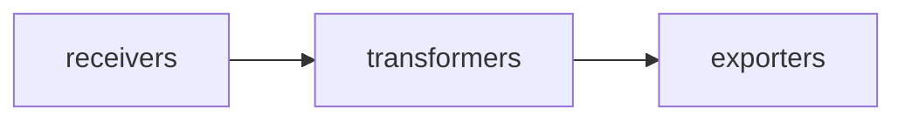

# Overview

## Perspectives

**Terms**

- _Namespaces_ are groupings of all kubernetes resources (ie. pods, deployments, roles, users)
- _OCP_ - `OpenShift Cloud Platform` or just `OpenShift`

The OpenShift console has a small number of "Perspectives". These perspectives can be swapped between through the dropdown in the top right of the console which appears when more than one perspectives is available. These perspectives provide information and pages specific to their use cases


| Perspective                           | Description                                             |
| ------------------------------------- | ------------------------------------------------------- |
| **Core Platform (previously Admin)**  | Full cluster-wide view                                  |
| **Developer**                         | Namespace-scoped view                                   |
| **Fleet Management (previously ACM)** | See Fleet Management section                            |
| **Virtualization**                    | See Virtualization section                              |
| **Fleet virtualization**              | Used to view virtualization information across clusters |

---

## Role Based Access Control (RBAC)

RBAC works through connecting users and with roles that have specific permission through role bindings. Users can also be added to groups which can also be targeted by role bindings.

- **role** - namespace-scoped permissions
- **cluster role** - cluster-wide permissions
- **role binding / cluster role binding** - connects a user to a role

For the Observability UI pages, most authentication is done on the signal backend. We forward the user's authentication token to the different signals and allow the signals to make decisions. We use RBAC to determine who can see the pages and what namespaces they can access, but the authentication is handled by the console and authorization is handled by the backends.

---

## Observability Signals

**Terms**

- _Signals_ are categories of telemetry captured to provide insights into your products and applications
- _CMO_ (Cluster Monitoring Operator) is used to deploy a metrics backends and frontend into an OpenShift cluster. It is part of the "core payload" which means that it is deployed by each cluster by default.
- _COO_ (Cluster Observability Operator) is used deploy various observability signals and frontends into an OpenShift cluster. It is an optional operator which requires users to manually install it and configure the signal's that it deploys.

| Signal         | What it collects                          | Backend                                                                                                                                                                                                |
| -------------- | ----------------------------------------- | ------------------------------------------------------------------------------------------------------------------------------------------------------------------------------------------------------ |
| Metrics        | metrics                                   | [prometheus](https://github.com/openshift/prometheus), [thanos](https://github.com/openshift/thanos), [Multi-cluster observability](https://github.com/stolostron/multicluster-observability-operator) |
| Alerts         | metrics                                   | [alertmanager](https://github.com/openshift/prometheus-alertmanager), [Multi-cluster observability](https://github.com/stolostron/multicluster-observability-operator)                                 |
| Logging        | logs                                      | [Loki](https://github.com/openshift/loki)                                                                                                                                                              |
| Tracing        | traces & spans                            | [tempo](https://github.com/os-observability/tempo)                                                                                                                                                     |
| Cluster Health | Aggregations of metrics and alerts        | [cluster-health-analyzer](https://github.com/openshift/cluster-health-analyzer)                                                                                                                        |
| Correlation    | no storage, dynamically finds connections | [korrel8r](https://github.com/korrel8r/korrel8r)                                                                                                                                                       |

### Metrics

Metrics consist of a name, a set of labels, a timestamp, and a value. For example:

- `cpu_usage{pod_name=test} 20:30 20`
- `requests{pod_name=test} 20:30 50`

Labels (e.g. namespace, pod name) allow you to filter down to what you're looking for. The value is a raw number - the unit (e.g. cores) is a convention, not part of the format. For counters like requests, the value represents the count since the last scrape, so comparing two scrapes gives you the rate. Metrics are queried using `promql`

The two main systems for storing and retrieving metrics are **Prometheus** and **Thanos**. Prometheus contains the actual database and handles sorting. Thanos provides long-term storage and can query across multiple Prometheus instances - for example, when user workload monitoring is enabled, a separate Prometheus instance is created for user workloads, and Thanos queries both.

### Alerts

Alerts typically consist of a set of labels (including a required alertname), annotations, and timestamps. For example:

```json
{
  "labels": {
    "alertname": "AlertmanagerReceiversNotConfigured",
    "namespace": "openshift-monitoring",
    "severity": "warning"
  },
  "annotations": {
    "description": "Alerts are not configured to be sent to a notification system, meaning that you may not be notified in a timely fashion when important failures occur. Check the OpenShift documentation to learn how to configure notifications with Alertmanager.",
    "summary": "Receivers (notification integrations) are not configured on Alertmanager"
  },
  "state": "firing",
  "activeAt": "2026-08-17T15:07:23.972761664Z",
  "partialResponseStrategy": "WARN"
}
```

Labels (e.g. namespace, severity) allow you to filter down to what you're looking for. Alerts are stored in alertmanager, which is able to aggregate alerts generated multiple signals and endpoints. For example, thanos evaluates metrics based rules and once the rules have passed their required firing period (ie. 5 minutes of being in the firing state) they are forwarded to the alertmanager. Our UI will often interface directly with the signal backends (for example the `/api/v1/rules` endpoint of thanos) to locate alerts which are in an "pending" state.

### Logging

Logs are timestamped entries, similar in structure to metrics - they carry tags (e.g. `pod_name=test`) that can be searched. We currently use **Loki** as the backend which is able to aggregate logs across various log formats and is queried through `logql`. We support both `viaq` and `otel` log label formats in the logging-view-plugin.

### Tracing

Traces track a unique ID across different resources, representing the full path a single request took. For example, a request may go through a router → authentication → target service, with each hop being a **span**.

A span captures information about one stop on that path: how long it took, what protocol was used (HTTP/HTTPS), what port, etc. The **distributed-tracing-console-plugin** shows the full trace with expandable spans.

The backend is **Tempo**.

### Cluster Health

The cluster health analyzer compiles metrics and alerts and creates `Incidents` which appear in the UI as groupings of related alerts. The cluster health analyzer exposes the `Incidents` as metrics which are queried through Thanos.

### Correlation

Correlation doesn't store anything. It dynamically takes a request (usually based on the current page URL in the OpenShift console) and finds connections in kubernetes. For example, from a pod page it can find:

- the deployment and operator the pod belongs to
- the logs for the pod
- network traffic via the netflow plugin

This correlation is completed via **korrel8r**.

## UI Plugins

| UI Plugin                                                                                                 | Feature flag                                  | Signals         | Deployed by                                                     | Support level | Perspectives                                    |
| --------------------------------------------------------------------------------------------------------- | --------------------------------------------- | --------------- | --------------------------------------------------------------- | ------------- | ----------------------------------------------- |
| [monitoring-plugin](https://github.com/openshift/monitoring-plugin)                                       | alerting, metrics, targets, legacy-dashboards | Metrics, Alerts | [CMO](https://github.com/openshift/cluster-monitoring-operator) | GA            | Core Platform, Developer, Virtualization        |
| [monitoring-console-plugin](https://github.com/openshift/monitoring-plugin)                               |                                               |                 |                                                                 |               |                                                 |
|                                                                                                           | acm-alerting                                  | Alerts          | [COO](https://github.com/rhobs/observability-operator)          | GA            | Fleet Management                                |
|                                                                                                           | cluster-health-analyzer                       | Cluster Health  | [COO](https://github.com/rhobs/observability-operator)          | GA            | Core Platform                                   |
|                                                                                                           | perses-dashboards                             | All             | [COO](https://github.com/rhobs/observability-operator)          | GA            | Core Platform, Virtualization, Fleet Management |
| [logging-view-plugin](https://github.com/openshift/logging-view-plugin)                                   |                                               | Logging         | [COO](https://github.com/rhobs/observability-operator)          | GA            | Core Platform, Developer                        |
| [distributed-tracing-console-plugin](https://github.com/openshift/distributed-tracing-console-plugin)     |                                               | Tracing         | [COO](https://github.com/rhobs/observability-operator)          | GA            | Core Platform                                   |
| [troubleshooting-panel-console-plugin](https://github.com/openshift/troubleshooting-panel-console-plugin) |                                               | Correlation     | [COO](https://github.com/rhobs/observability-operator)          | GA            | Core Platform                                   |

The `monitoring-plugin` is deployed by default by the Cluster Monitoring Operator, but each of the plugins deployed through the Cluster Observability Operator needs to have a UIPlugin Custom Resource (CR) created to enable them. Each CR has a specific name and type pair (ie. UIPlugin with type `monitoring` must have the name `monitoring`)

### Monitoring Plugin / Monitoring Console Plugin

The `monitoring-plugin` and `monitoring-console-plugin` are the same codebase with separate build processes. The `monitoring-plugin` is deployed via the . In the mid-term we are looking to move all repositories into the monitoring-plugin and enable each UI through feature flags.

---

## OpenTelemetry (otel)

OpenTelemetry provides a standardized middle layer for ingesting, transforming, and exporting observability signals. This makes the pipeline backend-agnostic - you only need to care about your pipeline configuration, not whether the backend is Loki, Elasticsearch, or something else.



For example: **Vector** (a log scraper) acts as a receiver, sending logs to the OTel collector, which transforms and exports them to Loki.

We don't have much direct involvement with OTel, but the label changes it introduces (e.g. viaq label - `namespace` → otel label - `k8s_namespace`)

---

## COO

Historically, each signal shipped its own plugin (Cluster Monitoring Operator ships monitoring-plugin, logging operator ships logging-view-plugin, etc.), meaning UI releases were tied to signal releases and each signal had its own configuration approach.

COO centralized the deployment and configuration of the observability plugins. One of the future goals for our observability organization is for COO to be a one-stop shop for observability - a user would say "I want logging, metrics, tracing" and COO would deploy and configure the operators, backends and frontends in an opinionated way.

This is already partially happening with some of the UI plugins

- creating a `troubleshooting-panel` UIPlugin deploys korrel8r
- creating a `monitoring-console-plugin` UIPlugin with the `cluster-health-analyzer` feature flag deploys the Cluster Health Analyzer backend.

---

## ACM

ACM (Advanced Cluster Management) adds multi-cluster management to OpenShift. The user facing verbage of ACM has recently changed to "Fleet Management". Each cluster using ACM will either be:

- **Hub cluster** - the central command center
- **Spoke cluster** - connects to the hub and follows its configuration

```mermaid
flowchart TD
    subgraph hub["Hub Cluster"]
        subgraph ACMOp["ACM Operator"]
            subgraph ACMObs["ACM Observability"]
                COL_HUB["Collector"]
                ST["Signal Storage (Alertmanager, thanos, loki)"]
            end
        end

    end

    subgraph spoke["Spoke Cluster"]
        subgraph ACMObsSpoke["ACM Observability"]
            COL["Collector"]
            STS["Signal Storage (Alertmanager, thanos, loki)"]
        end
        CL["clusterlet"]
    end

    ACMOp -->|Manages| CL
    CL -->|Creates| ACMObsSpoke
    STS -->|Forwards signals| COL_HUB
    COL --> STS
    COL_HUB --> ST

    style ACMOp fill:#1a1a2a,stroke:#4a4a9e
    style ACMObs fill:#1a2a1a,stroke:#4a9e4a
    style ACMObsSpoke fill:#1a2a1a,stroke:#4a9e4a
    style COL_HUB fill:#1a2a1a,stroke:#4a9e4a
    style ST fill:#1a2a1a,stroke:#4a9e4a
    style COL fill:#1a2a1a,stroke:#4a9e4a
    style STS fill:#1a2a1a,stroke:#4a9e4a
```



Installing the ACM Operator on an OpenShift cluster makes it a hub cluster and enables the Fleet Management perspective (showing connected spoke clusters, governance policies, etc.).

**Addons** (like ACM Observability) are similar to feature flags but can run actions on both hub and spoke clusters. Enabling the ACM Observability addon creates resources on the hub cluster and pushes a corresponding (but different) set of resources to spoke clusters. Once enabled, spoke clusters forward metrics and alerts to the hub cluster's Thanos Querier and Alertmanager respectively.

**Attaching a spoke cluster** is done by installing **clusterlet** on it, which handles communication between the hub and spoke.

The `UIPlugin` with type `monitoring` takes in two parameters when the `acm-alerting` feature flag is enabled:

- Alertmanager URL
- Thanos Querier URL

These are passed to the `monitoring-console-plugin` deployment and used to communicate with the hubs signals.

There are two sources of alerts on the hub:

1. Alerts forwarded directly from spoke cluster Alertmanagers
2. Alerts generated on the hub from forwarded metrics evaluated against rules

While the `acm-alerting` is in dev preview we only support alerts generated from forwarded metrics. Tech preview will add support for forwarded alerts. The Alertmanager URL is primarily used for silence management (creating, expiring, and extending silences).

---

## Dashboarding

OpenShift has transitioned from Grafana to the `legacy-dashboards` feature of the `monitoring-plugin` to Perses. Licensing changes in the Grafana upstream prevented the Observability team from embedding the Grafana UI inside of the OpenShift console. The follow up was a custom dashboarding solution located in the `monitoring-plugin` but it had a number of issues:

- Custom pages and components just for OpenShift, creates a high maintenance burden for a small team
- No user customisation of our plugins
- Each plugin must be independently installable, leading to a lot of repeated code

Our team decided to support the upstream Perses project and integrate it into our plugins to solve these issues. Allowing for an embedible customizable dashboard solution which is open source and extensible.

COO deploys the Perses Operator. When the `monitoring` type UIPlugin is created a `Perses` CR is created which the Perses Operator reconciles into a Perses backend. The Perses backend handles dashboard storage, RBAC, signal proxying, and provides a CLI to convert existing Grafana or OCP dashboards to Perses format.
